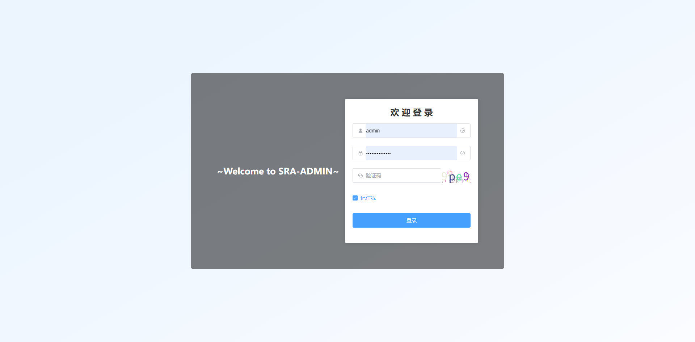
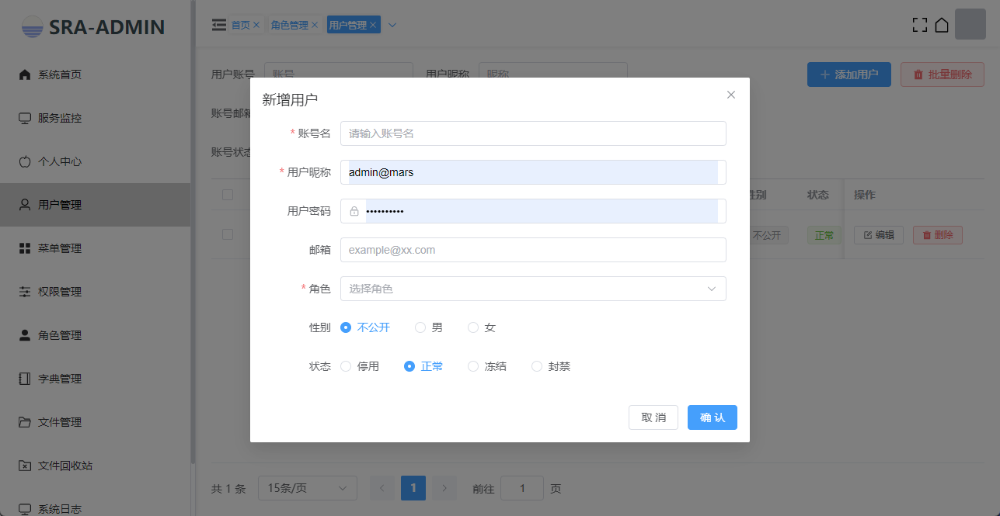
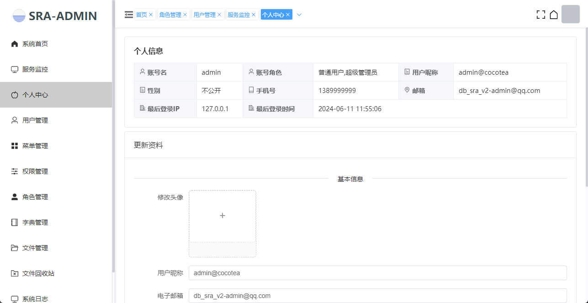
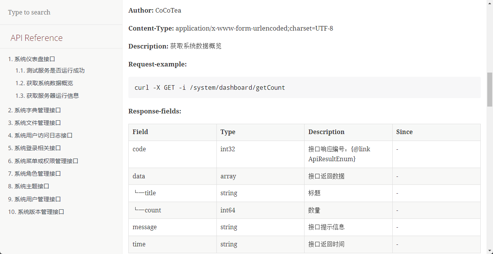

## 介绍
SraAdmin是一个前后端分离的后台管理系统，引入了市面上常用的工具包以及核心框架，只实现用户、字典、角色、权限等常见功能，
能够快速搭建一个web项目。  
后端技术栈：springboot3+sqltoy+satoken+hutool  
前端技术栈：vue3+vue-router+typescript+elementui

[](https://app.codacy.com/gh/CoCoTeaNet/sra-admin/dashboard?utm_source=gh&utm_medium=referral&utm_content=&utm_campaign=Badge_grade)

## 更新日志
[release-note.md](./release-note.md)


## 附加仓库
- sra-admin-vue（前端项目，基于VUE开发）：https://github.com/CoCoTeaNet/sra-admin-vue.git
- sra-admin-solon：https://github.com/CoCoTeaNet/sra-admin-solon


## 应用场景
- XXX网站 | 博客网站
- 编程学习 | 毕业设计
- XXX管理系统


## 图片演示
<table>
    <tr>
        <td></td>
        <td></td>
    </tr>
    <tr>
        <td></td>
        <td></td>
    </tr>
</table>


## 软件架构
[](https://i.postimg.cc/Bn7TLCXv/image.png)


## 启动说明
### 步骤
1. 运行数据库脚本：表结构、初始化数据
2. 启动本地Redis并运行后端服务
3. 安装前端依赖并运行前端项目

### 接口文档
使用命令或者idea的插件生成，具体使用参考地址：https://smart-doc-group.github.io/#/zh-cn/start/quickstart

### 备注
```text
1. 配置文件：sra-admin-service/sra-web/src/main/resources/application.yml
2. 数据库运行脚本：/doc/sql/*.sql
3. 项目启动类：sra-admin-service/sra-web/src/main/java/net/cocotea/admin/Launcher.java
```

### 访问地址
测试后端接口：http://localhost:9000/test/index


## 项目结构
```
├─doc
│  ├─bin                服务运行脚本
│  ├─imgs               演示图片
│  └─sra-admin-sql      数据库运行脚本 
│      ├─table_ddl.sql  表结构
│      └─table_data.sql 初始化数据
└─sra-admin-service     
    ├─sra-common        通用模块
    └─sra-web           web模块
```


## 核心技术栈
- [SpringBoot](https://spring.io/projects/spring-boot) ：Spring Boot 可以轻松创建可以“直接运行”的独立的、生产级的基于 Spring 的应用程序。
- [Sqltoy](https://gitee.com/sagacity/sagacity-sqltoy) ：java真正最强大的ORM框架，支持市场上流行数据库。
- [sqltoy-plus](https://gitee.com/gzghde/sqltoy-plus)：Sqltoy的加强版插件
- [Satoken](https://sa-token.cc/doc.html#/) ：一个轻量级 Java 权限认证框架，让鉴权变得简单、优雅！
- [Hutool](https://www.hutool.cn/) ：小而全的Java工具类库，使Java拥有函数式语言般的优雅，让Java语言也可以“甜甜的”。


## 软件版本要求
- JDK：17+
- Nodejs：14 ~ 19
- MySQL：8.0+


## 参与贡献
1. Fork 本仓库
2. 新建 Feat_xxx 分支
3. 提交代码
4. 新建 Pull Request

- 如有更好的想法，欢迎提[issue](https://github.com/CoCoTeaNet/sra-admin/issues)


## SraAdmin交流群
QQ群：[](https://jq.qq.com/?_wv=1027&k=lxODRWpq)

