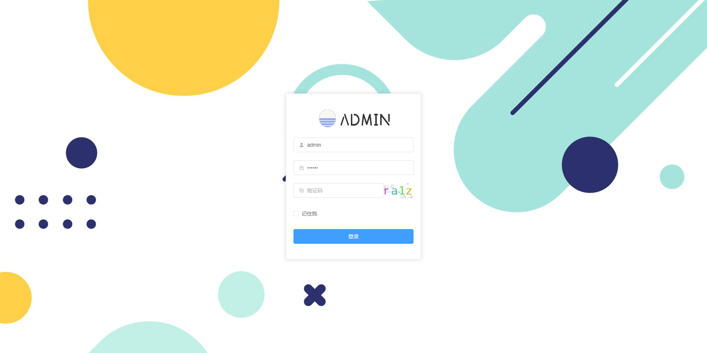
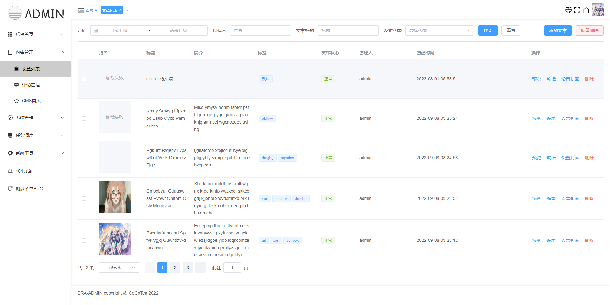
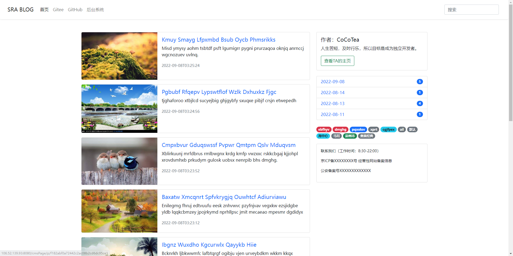

### 当前版本V1.3.0

#### 介绍
SRA-ADMIN 是一个前后端分离的后台管理系统，引入了市面上常用的工具包以及核心框架，实现了用户、字典、角色、权限等常见功能，
能够快速搭建一个web项目。  
后端技术栈：springboot+sqltoy+satoken+hutool  
前端技术栈：vue3+vue-router+typescript+elementui

#### 应用场景
- XXX网站 | 博客网站
- 编程学习 | 毕业设计
- XXX管理系统

#### 图片演示

<table>
    <tr>
        <td></td>
        <td></td>
    </tr>
    <tr>
        <td></td>
        <td></td>
    </tr>
</table>

#### 软件架构
[](https://i.postimg.cc/Bn7TLCXv/image.png)

#### 启动说明

* 步骤

1. 运行数据库脚本
2. 启动本地Redis并运行后端服务
3. 安装前端依赖并运行前端项目

* 后端

```text
1. 配置文件：/sra-bootstrap/src/main/resources/application.yml
2. 数据库执行脚本：/doc/sql/*.sql
3. 项目启动类：/sra-bootstrap/src/main/java/com/sraapp/bootstrap/AppBoot.java
```

- 前端

```bash
$ cd sra-ui                         #切换到前端目录
$ npm install   || yarn             #安装依赖  
$ npm run serve || yarn serve       #开发环境  
$ npm run build || yarn build       #生产环境
```

* 访问地址

1. 测试后端接口：http://localhost:9000/test/index
2. 前端登录地址：http://localhost:8080/#/login

#### 项目结构

```
├─doc  -------------------------文档  
│  ├─bin  ----------------------项目运行脚本  
│  └─sra-admin-sql  ------------ADMIN数据库脚本  
├─sra-bootstrap  ---------------启动模块  
├─sra-common  ------------------常用模块   
├─sra-framework  ---------------框架模块  
├─sra-system  ------------------系统模块  
├─sra-cms     ------------------内容模块  
├─sra-schedule  ----------------任务模块  
└─sra-ui  ----------------------前端VUE3项目  
```

#### 核心技术栈

##### 后端

- [SpringBoot](https://spring.io/projects/spring-boot) ：Spring Boot 可以轻松创建可以“直接运行”的独立的、生产级的基于 Spring 的应用程序。
- [Sqltoy](https://gitee.com/sagacity/sagacity-sqltoy) ：java真正最强大的ORM框架，支持市场上流行数据库。
- [Satoken](https://sa-token.cc/doc.html#/) ：一个轻量级 Java 权限认证框架，让鉴权变得简单、优雅！
- [Hutool](https://www.hutool.cn/) ：小而全的Java工具类库，使Java拥有函数式语言般的优雅，让Java语言也可以“甜甜的”。

##### 前端

- [Vue3开发文档](https://v3.cn.vuejs.org/) ：Vue 被设计为可以自底向上逐层应用。Vue 的核心库只关注视图层，不仅易于上手，还便于与第三方库或既有项目整合。
- [typescript](https://www.tslang.cn/index.html) ：TypeScript是JavaScript类型的超集，让你写出来的js也可以很优雅。
- [Element Plus](https://element-plus.gitee.io/zh-CN/) ：基于 Vue 3，面向设计师和开发者的组件库，简洁、美观、稳定、易用。

#### 软件版本要求

- JDK：1.8+
- Nodejs：14.0+
- MySQL：8.0+

#### 参与贡献

1. Fork 本仓库
2. 新建 Feat_xxx 分支
3. 提交代码
4. 新建 Pull Request

- [贡献指南](https://gitee.com/gitee-community/opensource-guide/blob/master/%E8%B4%A1%E7%8C%AE%E6%8C%87%E5%8D%97.md)
- 如有更好的想法，欢迎提[issue](https://gitee.com/momoljw/sss-rbac-admin/issues)


#### SRA交流群

QQ群：[](https://jq.qq.com/?_wv=1027&k=lxODRWpq)

#### 感谢支持
- [JetBrain Idea](https://jb.gg/OpenSourceSupport)  

